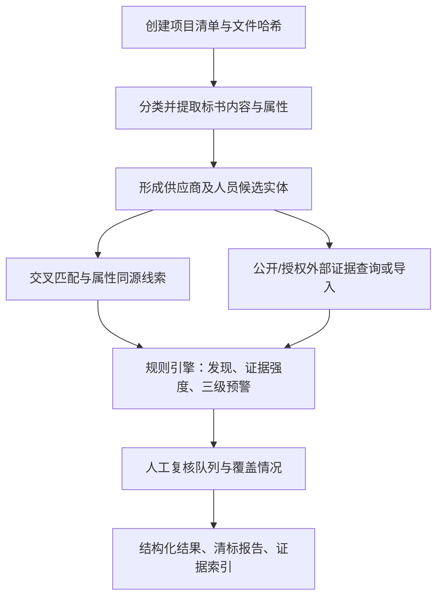

# 工作流（workflow）

## 处理流程

## 阶段与脚本

| 阶段 | 脚本 | 输入 | 输出（output/interim/） |
|---|---|---|---|
| 盘点 | `inventory.py` | 项目目录 | `inventory.json` |
| 内容提取 | `extract_content.py` | inventory | `content.json` + `evidence-content.json` + `low_confidence.json` |
| 属性提取 | `extract_metadata.py` | inventory | `metadata.json` + `evidence-metadata.json` |
| 主体与匹配 | `normalize_and_match.py` | content | `entities.json` + `matches.json` |
| 外部导入 | `import_external_evidence.py` | external-evidence/ | `external.json` + `evidence-external.json` |
| 外部查询 | `query_sources.py` | entities + external | 合并入 `external.json`（+`evidence-external-queries.json`） |
| 规则评估 | `assess_risk.py` | 全部中间产物 | `findings.json`（含 coverage、人工复核队列） |
| 渲染 | `render_report.py` | 全部中间产物 | `output/清标报告.md`、`清标结果.json`、`证据索引.csv`、`人工复核清单.csv`（可选 DOCX） |
| 校验 | `validate_project.py` | 项目目录 | 结构校验结果（exit 0/1） |

顺序不可颠倒：每个阶段只依赖前序产物的 JSON Schema（`schemas/`）。
可重复运行：所有 ID 由内容派生（`EV-`/`DOC-`/`MT-`/`Q-`/`R-`/`FD-`），
同一输入与规则版本连续运行两次，除运行标识与时间字段外结果逐字段一致。

## 关键规则

### 0. 本版字段范围

盘点阶段必须给 `bids/` 文件写入 `bid_subtype`：`business`、`technical`、
`bid_schedule`、`cover` 或 `unknown`。分类依据和人工修正结果必须保留在 inventory。
内容提取阶段只允许：

- `cover` 或标记为封面的第一页：招标人、项目名称、项目编号、投标日期；
- `business`：公司和商务授权/证照字段；
- `technical`、`bid_schedule`、`unknown`：不产生主体字段或公共项字段，但仍产出文档清单、属性和读取异常。

“未取得”“查询成功无匹配”“查询受阻”“未查询”“页面无结构化结果”必须使用不同状态；
不得用空表、空分类或自动化解析摘要替代真实证据截图。

1. **原始标书只读**：脚本从不写回 `bids/`、`procurement/`、`external-evidence/`。
2. **先盘点后提取**：未知格式、密码保护、损坏、零字节文件在盘点中记录状态与原因，
   提取阶段跳过并在报告中显示（T11）。
3. **主体识别**：以统一社会信用代码（校验位通过）为“已确认”前提；
   缺代码时以名称、地址、法定代表人形成候选（`candidate`），候选不合并、不自动归属外部记录。
4. **证据先行**：无证据 ID 的断言不允许进入 findings（`COV-001` 覆盖类发现除外，
   其证据为查询状态本身）。
5. **等级上限**（引擎统一强制，模型不可修改）：
   - 证据强度 D（自动推断/待确认）≤ III 级；
   - 主体未确认（candidate/unconfirmed）≤ III 级；
   - 仅名称模糊匹配的关联 ≤ III 级。
6. **低置信度**（OCR 置信度 < 0.85 或 mock OCR）字段：不参与精确匹配，只进人工核对（T09）。
7. **验证后再报告**：正式交付前运行 `validate_project.py --stage final`。

## 黑盒试跑（验收）

在干净临时目录中只提供 Skill 与测试夹具（`tests/fixtures/project-alpha`），
不提供预期报告与规则实现说明，执行：

> 使用 tender-clearance 对 fixtures/project-alpha 进行离线证据导入模式的清标。
> 投标截止日以项目文件为准，生成审阅版报告、结构化结果、证据索引和人工复核清单。
> 不要连接外部真实网站。

验收标准见 `../references/report-spec.md` 与方案 9.3。
