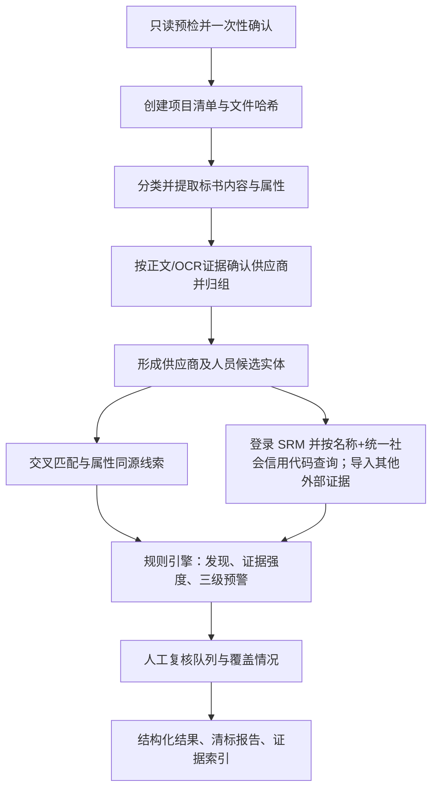

# 工作流（workflow）

## 处理流程

## 阶段与脚本

| 阶段 | 脚本 | 输入 | 输出（output/interim/） |
|---|---|---|---|
| 上传首轮确认 | `preflight.py --intake` | 项目目录、输出档位 | 截止时间、公开查询、SRM 授权/凭据和敏感信息展示的确认项（不读取业务文件） |
| 预检 | `preflight.py` | 项目目录、当前环境 | JSON 计划、缺失依赖、确认项（不安装、不联网） |
| 盘点 | `inventory.py` | 项目目录 | `inventory.json` |
| 一次性文档解析 | `extract_documents.py`（内部调用 content/metadata） | inventory | `content.json`、`metadata.json`、`ocr-jobs.json`、文档缓存 |
| OCR 导入 | `import_ocr_results.py` | `ocr-job.v1` + 宿主 `ocr-result.v1` | `ocr-results.json`、OCR 缓存、重建后的 `content.json` |
| 供应商归组 | `resolve_supplier_groups.py` | content + inventory + 可选人工确认 | `supplier-grouping.json`；未 resolved 时停止 |
| 主体与匹配 | `normalize_and_match.py` | content | `entities.json` + `matches.json` |
| 外部导入 | `import_external_evidence.py` | external-evidence/ | `external.json` + `evidence-external.json` |
| 外部刷新（报告前置） | `query_sources.py` | entities + 用户本次提供的 SRM 凭据 + 明确启用渠道 | 合并入 `external.json`（+`evidence-external-queries.json`）；SRM 登录成功但无结果为 `no_result` |
| 规则评估 | `assess_risk.py` | 全部中间产物 | `findings.json`（含 coverage、人工复核队列） |
| 渲染 | `render_report.py --profile report/review/workpaper` | 全部中间产物与缓存 | 根目录验收基准 + `output/exports/<profile>/` |
| 校验 | `validate_project.py` | 项目目录 | 结构校验结果（exit 0/1） |

推荐由 `run_pipeline.py` 编排正式阶段。它将每个脚本的墙钟耗时写入
`output/interim/performance.json`；`query_sources.py` 将每个已启动的渠道/供应商查询耗时写入
`query-timings.json`。实时查询默认 300 秒总预算；预算耗尽时，未启动项明确保留为
`not_queried`，不能绕过 SRM 门禁或被叙述为无风险。

流水线支持增量续跑：`run_pipeline.py --resume` 根据上一次的 `performance.json` 从首个未成功阶段继续；
`--from-stage` 与 `--to-stage` 用于显式限定连续阶段。阶段输出会直接转发到宿主，编排器不应使用
`sleep` 轮询。`query_sources.py` 在同一运行中默认复用匹配主体的成功 live 结果，仅 `--refresh` 强制
重新访问；失败、阻断、待人工确认和导入结果不复用。

顺序不可颠倒：每个阶段只依赖前序产物的 JSON Schema（`schemas/`）。
可重复运行：所有 ID 由内容派生（`EV-`/`DOC-`/`MT-`/`Q-`/`R-`/`FD-`），
同一输入与规则版本连续运行两次，除运行标识与时间字段外结果逐字段一致。

上传首轮确认必须先于预检、依赖安装和正式流水线：宿主收到文件后立刻确认截止时间、公开
联网授权、SRM 授权/凭据和敏感信息展示；确认后才读取业务文件并展示 JSON 预检计划，后续
阶段不临时提问。技术标按文件类型短路正文、表格和媒体，仅保留首页可见文本证据；扫描页不发起 OCR；
商务页的证照图片仍建立页级 OCR 任务。文档缓存以源 SHA 复用底层解析快照，
但内容/属性结果还校验文档身份、文件名分类、脱敏模式和 Provider 配置，避免同内容副本
串用证据路径。

## 关键规则

### 0. 本版字段范围

盘点阶段必须给 `bids/` 文件写入 `bid_subtype`：`business`、`technical`、
`bid_schedule`、`cover` 或 `unknown`。分类依据和人工修正结果必须保留在 inventory。
内容提取阶段只允许：

- `cover` 或标记为封面的第一页：招标人、项目名称、项目编号、投标日期；
- `business`：公司和商务授权/证照字段；
- `technical`、`bid_schedule`、`unknown`：仅首页可见文本可产生供应商归组候选；扫描页不发起 OCR，正文不产生主体字段或公共项字段，但仍产出文档清单、属性和读取异常。

“未取得”“查询成功无匹配”“查询受阻”“未查询”“页面无结构化结果”必须使用不同状态；
不得用空表、空分类或自动化解析摘要替代真实证据截图。

1. **原始标书只读**：脚本从不写回 `bids/`、`procurement/`、`external-evidence/`。
2. **先盘点后提取**：未知格式、密码保护、损坏、零字节文件在盘点中记录状态与原因，
   提取阶段跳过并在报告中显示（T11）。
3. **主体识别**：以统一社会信用代码（校验位通过）为“已确认”前提；
   缺代码时以名称、地址、法定代表人形成候选（`candidate`），候选不合并、不自动归属外部记录。
4. **证据先行**：无证据 ID 的断言不允许进入 findings（`COV-001` 覆盖类发现除外，
   其证据为查询状态本身）。
5. **等级上限**（引擎统一强制，模型不可修改）：
   - 证据强度 D（自动推断/待确认）≤ III 级；
   - 主体未确认（candidate/unconfirmed）≤ III 级；
   - 仅名称模糊匹配的关联 ≤ III 级。
6. **低置信度**（OCR 置信度 < 0.85、无坐标或 page-only）字段：不参与精确匹配，只进人工核对（T09）。
7. **SRM 门禁后再报告**：正式报告必须通过 SRM 登录/查询门禁；`no_result` 可通过，
   `not_queried`、`needs_manual_review`、`blocked`、`failed` 不可通过。

## 黑盒试跑（验收）

在干净临时目录中只提供 Skill 与测试夹具（`tests/fixtures/project-alpha`），
不提供预期报告与规则实现说明，执行：

> 使用 tender-clearance 对 fixtures/project-alpha 进行离线证据导入模式的清标。
> 投标截止日以项目文件为准，生成审阅版报告、结构化结果、证据索引和人工复核清单。
> 不要连接外部真实网站。

验收标准见 `../references/report-spec.md` 与方案 9.3。
