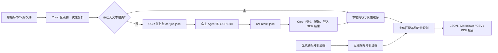

# 投标清标 Skill 实现方案（V2：轻量核心与宿主 OCR）

> 本文是对既有实现的增量改造方案，替代此前“清标 Skill 内置本地 PaddleOCR”的设计。
> 保留现有证据、规则、脱敏、SRM 和中国政府采购网边界；只重构 OCR、安装、缓存、
> 外部查询与报告生成之间的职责划分。

## 1. 目标、非目标与结论

`tender-clearance` 接收同一采购项目的多家供应商标书及经授权取得的外部证据，完成文件盘点、主体与文件属性交叉检查、确定性风险规则评估、人工复核清单和可追溯报告。输出始终是**风险线索与证据整理结果**，不自动作出串标、违法失信、资格不合格或废标结论。

本次改造的结论如下：

1. 清标 Skill 是轻量核心，不再安装、导入或运行 PaddleOCR、PaddlePaddle、PaddleX、Playwright 浏览器或任意 OCR 模型。
2. 扫描页 OCR 由用户正在使用的本地 Agent 的 OCR Skill 执行；清标 Skill 只生成任务、导入标准结果、验证证据链并使用结果。
3. 默认推荐 OCR 提供方为 **PaddleOCR 的 `PP-OCRv4_mobile_det` + `PP-OCRv4_mobile_rec`，以 ONNX Runtime CPU 推理**。它是面向 Windows 普通办公机的性能/模型体积折中；不把全功能 Paddle/PaddleX 环境作为默认安装。
4. 实时外部查询、首次 OCR、DOCX/Excel 导出都从“生成报告”中拆开。报告重跑只消费已缓存的本地提取结果和带时间戳的外部证据。

### 1.1 约束与不在范围内的能力

- 不创建、修改或提交供应商档案、失信名单、采购评审结论。
- 不绕过登录、验证码、限频、反爬、付费墙或其他访问限制。
- 不因同一模板、编辑工具、扫描仪型号或低置信度 OCR 单一线索认定串标。
- 不把 `blocked`、`failed`、`not_queried`、`no_result` 或 `ocr_unavailable` 写为“无风险”。
- 不在报告、日志、OCR 任务或异常中写入完整身份证号、手机号、密码、Cookie 或令牌。
- 不要求千问 Work、WorkBuddy 或其他中国 Agent 具备相同的 Skill 格式；只要求其能满足本文定义的 OCR 输入/输出契约。每个平台的能力必须实测，不得假定已支持。

## 2. 可验收的性能口径

“完整执行 60 秒”必须拆成不同性质的任务，不能把模型下载、网络限速和报告渲染混成一个无法达成的指标。

| 场景 | 责任边界 | 通过标准 |
|---|---|---|
| Core 安装 | 仅 `tender-clearance` 核心，无 OCR/SRM 浏览器/开发依赖 | Windows 11、Python 已就绪、国内可用镜像下，干净环境安装 ≤120 秒；锁文件固定。 |
| 标准报告重跑 | OCR 与外部证据缓存命中；只做增量盘点、规则和报告 | 固定基准夹具的 p95 ≤60 秒。 |
| 首次 OCR | 宿主 Agent 的 OCR Skill 负责；按扫描页数单独计时 | 记录冷启动、模型下载、每页和整批耗时；不承诺统一 60 秒。 |
| 外部证据刷新 | 中国政府采购网、SRM 或人工导入的获取过程 | 与报告分离，遵守授权、限频和人工接管要求；不计入报告 SLO。 |
| DOCX/Excel 导出 | 展示或工作底稿派生物 | 按需执行；不计入 Markdown/JSON 报告重跑 SLO。 |

基准夹具必须在实施开始前冻结：供应商数、文件数、总页数、扫描页数、文件大小、机器规格、Python 版本、缓存冷热状态和输出档位全部写入 `tests/perf/baseline.yaml`。未冻结基准前，不得宣传“60 秒完整清标”。

## 3. 总体架构



核心原则：OCR 和外部证据刷新是**资料获取**；风险评估和报告是**确定性再计算**。两者的缓存键、权限、耗时和失败状态必须独立。

## 4. 安装分层与发布物

### 4.1 Core 安装包

`tender-clearance` 的基础依赖仅包含：`pydantic`、`typer`、`jinja2`、`PyYAML`、`jsonschema`、PDF/Office 读取库和生成基础报告所需的 PDF 库。基础包禁止声明或间接拉取：

- `paddleocr`、`paddlepaddle`、`paddlex`、OpenCV、模型管理器；
- Playwright、浏览器二进制；
- pytest 等开发依赖；
- 可选 Excel/Word 导出运行时。

发布物必须包含 `pyproject.toml`、锁文件、`requirements-core.txt` 和 Windows PowerShell 安装说明，四者依赖集合一致。`pip install -e .`、README 手工依赖清单与发行包安装命令不得再互相矛盾。

### 4.2 OCR Provider 安装包

OCR Provider 是独立 Skill，不属于清标 Skill 的发行物。推荐的 Provider Profile：

| 项目 | 默认值 |
|---|---|
| 引擎 | PaddleOCR 文本检测/识别能力 |
| 检测模型 | `PP-OCRv4_mobile_det` |
| 识别模型 | `PP-OCRv4_mobile_rec` |
| 推理引擎 | ONNX Runtime CPU；一个环境只保留一种推理引擎 |
| 语言 | 简体中文、英文、数字 |
| 输出 | 页级文本、文本块、归一化坐标、置信度、模型与运行时版本 |
| 升级策略 | 仅对低置信度、表格密集、盖章遮挡或人工指定页面切换至 `PP-OCRv5_mobile` |

不选用旧的 `PP-OCRv3_mobile_rec_slim` 作为默认，尽管模型更小；涉及统一社会信用代码、姓名和证件字段时，识别余量不足会显著放大人工复核量。

### 4.3 Provider 发现与安装

项目初始化时（不是报告运行时）按以下顺序执行：

1. 查询当前 Agent 已安装的 OCR Skill，并请求其输出 `ocr.capabilities.v1`；
2. 有兼容能力时复用，不安装任何新依赖；
3. 无兼容能力时，在该 Agent 支持的 Skill 市场中查找 PaddleOCR 文本识别 Skill；
4. 经平台安全扫描后安装一次，并运行小样本自检；
5. 如果平台不支持发现/安装或安装失败，记录 `ocr_unavailable`，生成人工复核任务，不得在真实报告任务中临时安装、下载模型或改动系统环境。

发现器只负责输出“可用/不可用”和安装建议，不得伪造某个 Agent 已有 OCR 能力。对云端 OCR，必须由用户明确同意原始标书离开本机，并在结果中记录 `data_processing_location=cloud`；默认只接受本地处理。

## 5. 跨 Agent OCR 契约

### 5.1 能力声明：`ocr.capabilities.v1`

宿主 OCR Skill 至少声明：`contract_version`、`provider_id`、`provider_version`、`processing_location`（`local` / `cloud`）、支持的输入格式、最大页数/文件大小、支持语言、是否返回置信度、是否返回文本块坐标、模型名和推理引擎。

清标 Skill 只接受同时满足以下条件的 Provider：

- 支持 PDF 页或 PNG/JPEG 输入；
- 支持 `zh-Hans`、`en` 和数字；
- 返回每页平均置信度，或每个文本块置信度；
- 返回页号与文本，坐标缺失时显式标记 `location_precision=page_only`；
- 可回传实际模型/运行时版本与处理位置。

### 5.2 任务输入：`ocr-job.v1.json`

Core 仅为无文本层的页生成任务。每个任务必须包含：

```json
{
  "contract_version": "ocr-job.v1",
  "job_id": "OCRJ-...",
  "document_id": "DOC-...",
  "source_sha256": "...",
  "page": 1,
  "page_image_sha256": "...",
  "input_ref": "受控的相对路径或临时页图",
  "languages": ["zh-Hans", "en"],
  "mode": "accurate",
  "purpose": "tender_clearance_field_candidates",
  "privacy_requirement": "local_only"
}
```

禁止在任务中写入推测的供应商名称、身份证号、Cookie、密码或外部系统链接。`input_ref` 的读取授权应只覆盖任务页，完成后按项目留存策略清理临时渲染图。

### 5.3 结果输入：`ocr-result.v1.json`

Provider 必须返回以下最小结构：

```json
{
  "contract_version": "ocr-result.v1",
  "job_id": "OCRJ-...",
  "document_id": "DOC-...",
  "source_sha256": "...",
  "page": 1,
  "status": "succeeded",
  "provider": {
    "id": "paddleocr-text-recognition",
    "version": "...",
    "engine": "onnxruntime-cpu",
    "models": ["PP-OCRv4_mobile_det", "PP-OCRv4_mobile_rec"],
    "processing_location": "local"
  },
  "average_confidence": 0.91,
  "blocks": [
    {"text": "统一社会信用代码", "confidence": 0.98,
     "bbox": {"x": 0.10, "y": 0.12, "width": 0.22, "height": 0.03}}
  ],
  "completed_at": "2026-09-10T00:00:00+08:00"
}
```

`status` 只能为 `succeeded`、`failed`、`blocked`、`not_supported`、`cancelled`。失败结果必须包含可展示、无敏感信息的 `detail`。Core 遇到哈希、页码、文档 ID 或契约版本不一致时，拒绝导入并记录 `ocr_result_invalid`；不得把任何 OCR 返回直接当成字段事实。

### 5.4 清标侧处理规则

- Core 对 `blocks` 按空间邻近关系匹配标签和值，禁止把无坐标 OCR 文本按全文正则随意配对；只有 `page_only` Provider 才允许降级的全文候选匹配，且全部标为低置信度。
- OCR 字段置信度取 Provider 块置信度、标签值空间距离和字段校验结果中的最低值。
- 统一社会信用代码、身份摘要、公司名等 OCR 得出的字段默认不得参与 I/II 级精确匹配；只有原件文本层或人工确认后的值可提升。
- 置信度低于配置阈值、无坐标、Provider 无法声明模型版本、或存在字符校验失败时，均进入人工复核清单。

## 6. 项目数据、缓存与增量运行

### 6.1 目录和数据对象

在既有项目目录中增加受控中间产物，不改写 `bids/`、`procurement/` 或 `external-evidence/`：

```text
output/
├── interim/
│   ├── inventory.json
│   ├── documents.json                 # 一次性解析的文本与属性基础结果
│   ├── ocr-jobs.json
│   ├── ocr-results.json
│   ├── content.json
│   ├── metadata.json
│   ├── entities.json
│   ├── matches.json
│   ├── external.json
│   └── findings.json
├── cache/
│   ├── document/<sha256>.json
│   ├── ocr/<source_sha>/<page>/<provider-fingerprint>.json
│   └── external/<source>/<subject-key>/<evidence-hash>.json
└── exports/
    ├── 清标结果.json
    ├── 清标报告.md
    ├── 清标报告.pdf
    ├── 证据索引.csv
    └── 人工复核清单.csv
```

OCR 缓存键至少由原文件哈希、页号、页图像哈希、Provider ID/版本、模型集合、推理引擎、语言和识别模式组成。输入、模型或运行时改变时自动失效；相同键必须复用，禁止重复识别。

### 6.2 一次性解析

现有内容提取和元数据提取均会打开 PDF、枚举图片。迁移后合并为 `extract_documents.py`：

1. 一次读取 PDF/DOCX/XLSX，输出文本层、文档属性、XMP、表单、嵌入文件、图片 EXIF、页数、扫描页标识和可复用的证据定位；
2. 对有文本层页直接建立字段候选；
3. 对无文本层页只创建 OCR 任务，不在 Core 内渲染或运行 OCR；
4. 对未变更文件直接命中文档缓存；
5. `import_ocr_results.py` 合并已验证结果后再生成最终 `content.json`。

这样可以消除重复 PDF 解码和每次完整重跑都重新 OCR 的问题。

## 7. 外部证据、报告与输出档位

### 7.1 外部证据刷新

外部渠道只保留：中国政府采购网（允许的公开查询）和富奥 SRM（现有账户会话或授权导出）。刷新命令/任务必须显式触发，生成可追溯的快照或授权导出引用；报告运行只读取缓存。

每条外部证据都带：主体键、查询时间、渠道、授权/请求方式、状态、适配器版本、原始证据哈希和过期策略。状态 `match`、`no_match_verified`、`no_result`、`not_queried`、`blocked`、`failed`、`needs_manual_review` 必须原样进入覆盖矩阵。

### 7.2 输出档位

| 档位 | 默认产物 | 用途 |
|---|---|---|
| `report` | JSON、Markdown、CSV、PDF | 正式审阅；仅消费缓存，不运行 OCR/外部查询。 |
| `review` | `report` + DOCX | 需要 Word 批注或线下流转时。 |
| `workpaper` | `review` + Excel 底稿 | 财务/合规底稿要求时。 |

PDF 仍需经过脱敏回读校验；DOCX、Excel 为按需派生物。无论输出档位如何，风险等级只能由版本化 YAML 规则引擎确定，模型或 OCR Provider 不得改变规则结论。

## 8. 迁移实施批次

| 批次 | 改动范围 | 交付与完成定义 |
|---|---|---|
| M0：基线与依赖收敛 | 清点 Core 当前依赖；拆出 OCR/浏览器/开发 extras；冻结 Windows 锁文件与性能夹具 | Core 干净安装通过；Core 中不存在 `paddle*`、OpenCV、Playwright 导入。 |
| M1：OCR 契约 | 增加 `ocr.capabilities.v1`、任务/结果 Schema、导入校验和失败状态 | 兼容 Provider 能导入；缺失/损坏/哈希不符结果均被拒绝且可追踪。 |
| M2：Paddle Provider Profile | 为支持的宿主 Agent 提供 `PaddleOCR + PP-OCRv4_mobile + ONNX Runtime CPU` 独立 OCR Skill；实现发现、自检和安装记录 | 在 Windows 样机上以真实扫描件完成能力自检；Provider 不进入 Core 环境。 |
| M3：增量管线 | 合并文档内容/属性解析；按文件和 OCR 页缓存；从 OCR 导入后再构建字段候选 | 未变更文件不再解析/OCR；改变一页只重做该页及受影响规则。 |
| M4：解耦查询与导出 | 将外部刷新移出报告；实现 `report/review/workpaper` 输出档位 | 报告任务的测试替身若收到 OCR 或网络调用即失败。 |
| M5：回归与发行 | 更新 SKILL.md、README、Schema、示例、安装说明、Windows 验证记录 | 旧规则测试、新 OCR 契约测试、黑盒试跑和性能验收全部通过。 |

禁止在 M0 前删除旧 `tc/ocr_paddle.py`：先以兼容层把它标记为废弃并确保 Core 不导入，待 M5 发布和迁移验证完成后再移除。现有 SRM 浏览器适配器也不在本次重构中删除，只迁出 Core 安装包。

## 9. 测试与验收

### 9.1 保留的业务测试

保留并继续运行既有 T01–T12：主体不误合并、唯一标识线索分级、外部状态显性化、敏感信息脱敏、损坏文件容错和重复运行确定性。需把所有旧的“本地 Paddle 必装”测试改为 Provider 结果夹具，避免测试环境拉取大型模型。

### 9.2 新增 OCR 与性能测试

| 编号 | 场景 | 断言 |
|---|---|---|
| T13 | Agent 声明兼容的本地 Paddle Provider | 生成任务后可导入完整结果，记录模型/引擎/位置。 |
| T14 | 无 OCR Skill 或 Provider 安装失败 | 不崩溃；扫描页为 `ocr_unavailable` 并进入人工复核。 |
| T15 | 结果哈希、文档 ID、页号或契约版本错误 | 拒绝导入，标记 `ocr_result_invalid`，不生成字段。 |
| T16 | 低置信度或无坐标 OCR | 不参与精确匹配，只进入人工复核。 |
| T17 | OCR 文本标签和值错行 | 空间配对失败时不臆测字段；生成可定位的待核任务。 |
| T18 | 相同输入、模型与配置第二次运行 | 不调用 Provider，命中 OCR 缓存；结构化结果稳定。 |
| T19 | 仅改动一页扫描件 | 仅该页 OCR 缓存失效，其他页不重跑。 |
| T20 | `report` 档位 | Provider 和网络测试替身均未被调用，p95 达到冻结基线。 |
| T21 | Windows 安装 | Core 安装、Paddle Provider 安装分别计时、分别记录包大小和模型下载量。 |

### 9.3 OCR 质量门槛

在不进入真实投标文件仓库的受控评测目录中，抽取经授权的中文扫描商务标页，人工标注：统一社会信用代码、公司全称、法定代表人和授权代表姓名、页号与字段所在区域。

分别测量 `PP-OCRv4_mobile`、`PP-OCRv5_mobile` 与人工复核成本。默认模型至少应满足：

1. 不把错误 OCR 字段提升为 I/II 级事实；
2. 低置信度和校验失败字段全部进入人工复核；
3. 对关键字段的召回率、字符准确率、每页耗时和冷启动体积均有可复核记录。

若 v4 mobile 未达到业务可接受的关键字段召回率，则只对问题页升级 v5 mobile，不恢复将完整 Paddle 环境嵌回清标 Skill。

### 9.4 黑盒验收

独立 Agent 只获得 Core、虚构夹具、一份 OCR 结果夹具和如下指令：

> 对 `fixtures/project-alpha` 生成缓存证据模式的清标报告。不得联网、不得安装 OCR、不得调用外部浏览器。输出 JSON、Markdown、PDF、证据索引和人工复核清单。

通过条件：所有发现可回溯；扫描页 OCR 状态真实；OCR 低置信度不进入精确匹配；外部来源状态未被美化；不存在完整敏感信息；报告流程不触发 OCR 或网络调用。

## 10. 文件级交接清单

| 文件/目录 | 处理方式 |
|---|---|
| `skills/tender-clearance/pyproject.toml` | 拆分 Core、开发、OCR Provider、SRM 浏览器依赖；添加锁定策略。 |
| `skills/tender-clearance/SKILL.md` | 改为发现/导入宿主 OCR 结果，不再指示安装 `.[ocr]`。 |
| `scripts/tc/ocr_paddle.py` | 先废弃隔离；Provider Skill 中保留或重写为 ONNX Runtime Profile。 |
| `scripts/extract_content.py`、`extract_metadata.py` | 迁为一次性解析和 OCR 结果导入，消除重复 PDF 遍历。 |
| `scripts/query_sources.py` | 仅作为显式证据刷新任务，报告流程不调用。 |
| `scripts/render_report.py`、`render_worksheet.py` | 实现输出档位，DOCX/Excel 按需执行。 |
| `schemas/`、`references/data-contract.md` | 增加 OCR Capability、Job、Result、缓存与失败状态契约。 |
| `tests/` | 用 OCR Provider 夹具替代强依赖模型冒烟；增加 T13–T21。 |
| README、INSTALL、发行包 | 统一 Core/Provider/SRM 三层安装说明与 Windows 验证记录。 |

## 11. 仍需业务确认的事项

1. Windows 目标机器的最低规格、Python 版本、是否允许安装 ONNX Runtime，以及是否有固定国内包/模型镜像；
2. 真实扫描件 OCR 可否在用户本机处理，还是允许提交至特定云端 Agent；
3. “60 秒标准报告重跑”的基准文件规模和允许的输出档位；
4. 哪些采购文件资格条款会使风险线索影响资格审查，以及适用时间截点；
5. SRM 与中国政府采购网外部证据的刷新频率、授权范围和留存期限。

未确认时的安全默认值是：只执行 Core、只读取已有 OCR/外部证据、报告真实展示缺口、不联网、不安装依赖、不对扫描页或外部风险作无依据结论。

## 12. 参考依据

- [PaddleOCR v3 模型列表](https://github.com/PaddlePaddle/PaddleOCR/blob/main/docs/version3.x/model_list.md)
- [PaddleOCR 推理引擎说明](https://github.com/PaddlePaddle/PaddleOCR/blob/main/docs/version3.x/inference_deployment/local_inference/inference_engine.en.md)
- [PP-OCRv5 模型和性能对比](https://github.com/PaddlePaddle/PaddleOCR/blob/main/docs/version3.x/algorithm/PP-OCRv5/PP-OCRv5.en.md)
